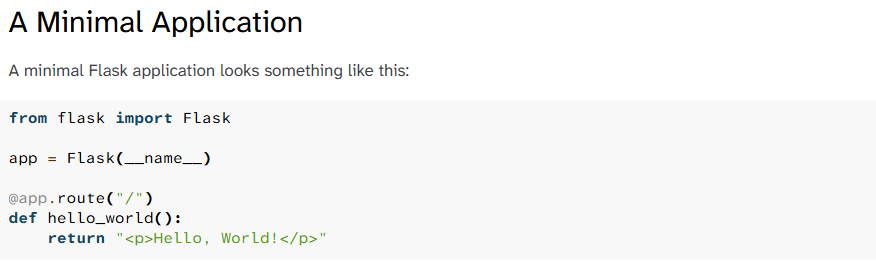

# Budgeting-System
Software Engineering Final Project

## System Architecture 
Frontend: HTML, CSS, JS 
Backend: Python with Flask 
Database: MySQL 

## Project Tool Documentation 
Flask is used as the Web Framework.

Regarding Flask Documentation, please use the link below:
https://flask.palletsprojects.com/en/stable/quickstart/

Also see the below screenshot:

This also outlines some code that was used in the inital app.py code.

